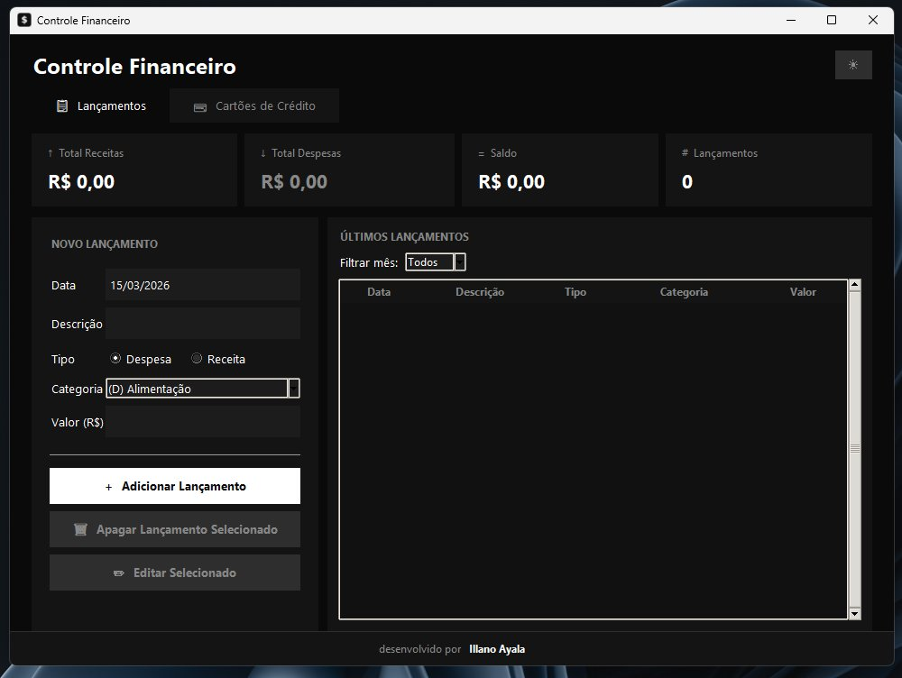
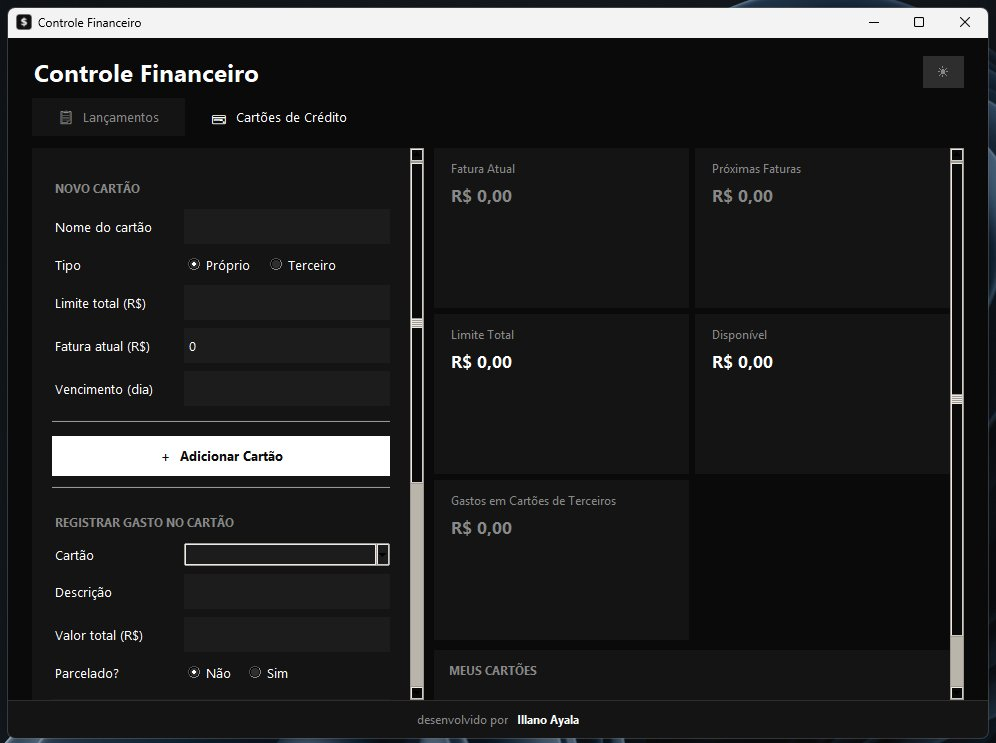

# Controle Financeiro

Aplicação desktop para controle de finanças pessoais, desenvolvida em Python com Tkinter e SQLite.

## Screenshots

<p align="center">
  
  &nbsp;
  
</p>

## Funcionalidades

- **Lançamentos** — registre receitas e despesas com categoria, data e valor
- **Cartões de Crédito** — controle fatura atual, próximas faturas e parcelamentos
- **Cartões de Terceiro** — registre gastos em cartões de outras pessoas sem afetar seus limites
- **Tema Dark/Light** — alterne entre os temas com transição animada
- **Filtro por mês** — visualize lançamentos por período

## Estrutura do Projeto

```
controle-financeiro/
├── main.py               # Ponto de entrada
├── database.py           # Camada de dados (SQLite)
├── constants.py          # Categorias, meses, temas e cores
├── assets/               # Screenshots e recursos
├── ui/
│   ├── app.py            # Classe principal App (tema, interface)
│   ├── aba_lancamentos.py # Aba de lançamentos
│   ├── aba_cartoes.py    # Aba de cartões de crédito
│   └── widgets.py        # Helpers compartilhados (btn, entry, fmt)
├── requirements.txt
├── .gitignore
└── README.md
```

## Como usar

**Pré-requisito:** Python 3.8 ou superior (sem instalação de pacotes extras).

```bash
# Clone o repositório
git clone https://github.com/IllanoAyala/controle-financeiro.git
cd controle-financeiro

# Execute
python main.py
```

O banco de dados `controle_financeiro.db` será criado automaticamente na primeira execução.

## Banco de Dados

Os dados são armazenados em SQLite (`controle_financeiro.db`). Para visualizar e editar diretamente, use o [DB Browser for SQLite](https://sqlitebrowser.org/).

| Tabela | Conteúdo |
|---|---|
| `lancamentos` | Receitas e despesas do dia a dia |
| `cartoes` | Cartões cadastrados |
| `gastos_cartao` | Gastos individuais por cartão |
| `faturas_futuras` | Parcelas e faturas futuras por cartão |
